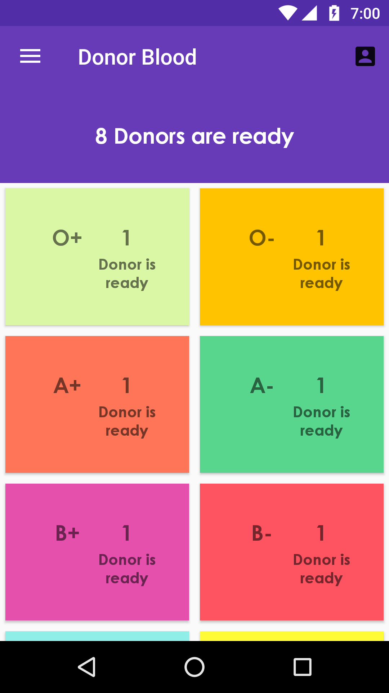

DonorBlood
===========
DonorBlood is a realtime database based **CRUD** that fetches data from a Firebase Realtime Database and displayes on User Request. 

Introduction
------------
  DonorBlood is an android application sample that implements
  - [Firebase RealTime Database](https://firebase.google.com/docs/database/)
  - Single Activity, Fragment Based Navigation Paradigm (http://androidandotherthings.com/designing-your-views-activities-or-fragments).
  - Basic **Model-View-Presenter** Architecture implementation

Screenshot
-----------

Getting Started
---------------
- [Add Firebase to your Android Project](https://firebase.google.com/docs/android/setup).
- Log in to the [Firebase Console](https://console.firebase.google.com).
- Go to **Database** tab and Import the [Sample JSON File](sample/donorblood-174b0-export.json)
- Run the sample on Android device or emulator.

Additional Notes
------------------
- Theres an add user console within the app, hidden as an easter egg.
    - Get to About Screen -> Tap 7 Times on Copyright Notice -> Enter ACCESS_CODE ->Click "Access"
    - The Access Code is fetched from the DB Path [Config\ADMIN_SECRET_HASH], It's MD5 Encryption is stored. 
    `DEFAULT VALUE [Empty String] : d41d8cd98f00b204e9800998ecf8427e`

Support
-------
- [Mail](mailto:amalgta@gmail.com)
- [Stack Overflow](https://stackoverflow.com/questions/tagged/firebase-database)
- [Firebase Support](https://firebase.google.com/support/)

License
-------

Copyright 2016 Styx, Inc.

Licensed to the Apache Software Foundation (ASF) under one or more contributor
license agreements.  See the NOTICE file distributed with this work for
additional information regarding copyright ownership.  The ASF licenses this
file to you under the Apache License, Version 2.0 (the "License"); you may not
use this file except in compliance with the License.  You may obtain a copy of
the License at

  http://www.apache.org/licenses/LICENSE-2.0

Unless required by applicable law or agreed to in writing, software
distributed under the License is distributed on an "AS IS" BASIS, WITHOUT
WARRANTIES OR CONDITIONS OF ANY KIND, either express or implied.  See the
License for the specific language governing permissions and limitations under
the License.
